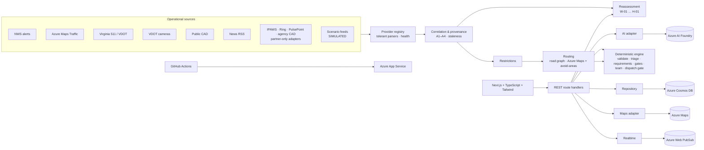

# CoORDINATE — From chaos to coordinated action.

**A Disaster Assistance Navigator that can also orchestrate the response** — a working
prototype for the *Microsoft & CCI Innovation Challenge for Virginia* (September 21–25, 2026).

CoORDINATE combines real-time disaster conditions, community needs, and available
capabilities to turn requests for help into safe, coordinated response missions.

A person asking for help first gets a trusted, understandable answer about what to do. Each
need in their message gets its own **resolution path** — information, a trusted service, a
human handoff, a professional response — and only where community capacity is the right
answer, and the person asks for it, does CoORDINATE turn that need into a capability-matched
mission that is re-planned as conditions change.

```
NAVIGATE THE PERSON → RESOLVE THE NEED → COORDINATE THE RESPONSE

request → AI understanding → safety triage → needs → resolution path per need
        → guidance · trusted services · human / professional handoff
        → (if requested) capabilities → gated matching → team → human dispatch
        → routing & continuous reassessment → verified completion → need resolved
```

| A traditional assistance navigator | CoORDINATE |
| --- | --- |
| Need → information / resource recommendation | Need → trusted guidance → the right resolution path → referral / human escalation / professional response / capability-matched community action → continuous operational reassessment |

> **The core design rule: AI never makes a safety-critical decision.**
> Azure AI Foundry understands language and images, extracts needs (with the words that
> support them) and drafts summaries. Deterministic, unit-tested code decides whether
> civilians may respond, which path each need takes, who is eligible, which outside reports
> are actionable, and when a mission must hold or reroute. People dispatch, escalate and resume.

---

## Try it in 3 minutes

```bash
npm install
npm run dev        # http://localhost:3000/demo
```

No Azure account, API key or database is required: every Azure integration has
a local fallback. Open **`/demo`** for the guided judge walkthrough
([script](docs/DEMO_SCRIPT.md)), 10 steps:

1. a resident writes one message: tree across the driveway, power out, a wheelchair user at home, nowhere to stay, a FEMA question;
2. **the navigator answers**: immediate priority first, then each need with its path — a shelter coordinator handoff, the utility, FEMA with its declaration condition stated honestly — and an *offer* of community help, which the resident requests;
3. the coordinator sees needs → resolution paths; only the requested needs became capability requirements;
4. the nearest volunteer is **rejected** (pending chainsaw credential) and a farther qualified one is selected;
5. the coordinator dispatches, and the route is planned: **11 min via Rte 419**;
6. camera AI flags an obstruction (**nothing happens**), then VDOT closes Rte 419 — **rerouted, 11 → 19 min**;
7. a **tornado warning holds three other missions**; resume is refused until it ends;
8. a second resident writes **“There is a sparking power line.”** → *Professional emergency response required. No community mission created.* Handoffs say why, who and what;
9. the volunteer completes and the resident confirms — the need is resolved;
10. impact, including needs by resolution path.

Each browser gets its own sandbox copy of a fictional Roanoke Valley storm
scenario (20 incidents, 19 volunteers, 5 organizations, simulated NWS / VDOT /
camera / CAD / news feeds), so several judges can use one deployment at once.

### Two modes, chosen by route

| Route | Workspace | Data |
| --- | --- | --- |
| **`/demo`**, `/demo/ops`, `/demo/request`, `/demo/volunteer`, `/demo/map`, … | this browser's private sandbox | The fictional exercise: deterministic, never calls a live feed, works with every external service down. |
| **Every other page** (`/request`, `/volunteer`, `/ops`, `/map`, `/live`, …) | the one shared **live operation** | Real requests from residents, real volunteers who register themselves, and real Virginia feeds on every map: **NWS active alerts** now; VDOT SmarterRoads events, VDOT cameras, a public CAD feed and news RSS when configured. Nothing fictional, and no fallback to scenario data. |

In the live operation, visitors start as an anonymous resident; volunteers register on *Offer help* (unverified
until a coordinator verifies identity and credentials); acting as coordinator needs `COORDINATE_COORDINATOR_PASSCODE`.
Sign-in cookies are separate per mode and HMAC-signed in the live operation.

Both providers implement one interface (`src/server/situation.ts`), so the same correlation,
map and condition components serve both. Live items flow **source adapter → validation →
normalization (with provenance) → dedup by source + sourceId → Cosmos DB → Web PubSub → `/live`**.
Every item keeps `source`, `sourceId`, `sourceUrl`, `sourceUpdatedAt`, `ingestedAt`,
`expiresAt`, a `rawHash` and the raw payload (stored for audit, never sent to browsers).
`/live` shows each source as healthy, degraded, stale, offline or unavailable, the last update
time, and marks items from an unhealthy source **STALE**: cached data is never presented as
current. News is shown as supplemental, unverified intelligence. See
[docs/DATA_SOURCES.md](docs/DATA_SOURCES.md#live-mode-live).

**Dispatching short-handed.** If only *optional* equipment or a supporting role is missing
(a pickup truck for debris, a wet/dry vacuum, a second lifter), the coordinator can dispatch
after explicitly acknowledging the gap, with a note for the team; the mission, timeline and
briefing record what it went without. Essential roles (credentialed leads, two-person safety
rules, accessible transport, PPE) can never be skipped.

## What's in the product

| Screen | For | Highlights |
| --- | --- | --- |
| `/request` → `/request/[id]` | Residents | **The navigator**: plain-language intake (just words + location), immediate priority, every identified need with its path and evidence, trusted services with source, date and eligibility, and *Request coordinated help* for community-eligible needs; then a status tracker that explains holds and reroutes |
| `/demo` | Judges | 10-step guided flow with a "who decides this step — AI or rules?" panel and a timer |
| `/ops` | Emergency-management coordinator | **Common operational picture**: map with incident, resource, hazard-area, road-condition, route and camera layers; *Exercise* vs *Live Virginia* views; field-operations board (holds, reroutes, route acknowledgement, resume); conditions with provenance, verification status, confidence and **"Why?"** evidence; data-source status derived from real fetch results; exercise controls; status tiles, filters, KPIs, AI-drafted SITREP, capability gaps |
| `/ops/incidents/[id]` | Coordinator | Incident workbench: **needs → resolution paths** (rule, evidence, services, request-on-behalf, mark resolved), handoffs with why / who / what and Foundry-drafted summaries, AI interpretation vs. validation, safety triage with every rule, required capabilities, candidates with pass/fail gates and score breakdowns, "why selected" team cards, dispatch gate (incl. route and weather checks), planned route, hold/reroute state and decision records, linked evidence, opt-in camera snapshot, recorded escalations, audit timeline |
| `/volunteer` | Volunteers | Readiness level, credentials, equipment, availability, **only eligible missions**, active mission with route, hold instructions and route acknowledgement |
| `/map` | The public | Hazard map of official and corroborated conditions only — never people, requests, missions or private cameras |
| `/preparedness` | Volunteers, coordinators | Training modules (internal badges only), external credential upload → coordinator verification, readiness ladder |
| `/resources` | Coordinators | Community capacity: people, organizations, equipment inventory, gaps |
| `/how-it-works` | Everyone | Rule tables (hazard, policy, correlation, reassessment, score weights, data sources) rendered from the executing modules |

Roles: resident, general volunteer, trained/credentialed volunteer, skilled
professional, nonprofit/community organization, business/resource provider and
authorized coordinator (sign-in simulated with a persona switcher).

## Architecture



Full diagrams (request lifecycle, reassessment sequence, mission state machine,
data model, API): **[docs/ARCHITECTURE.md](docs/ARCHITECTURE.md)**.

### Microsoft technology, used substantively

| Service | Role in CoORDINATE |
| --- | --- |
| **Azure AI Foundry** | Interprets free-text requests and photos into structured incident proposals; classifies live public-camera frames on request into *unverified* machine observations; drafts team briefings; drafts SITREPs that include held missions, reroutes and conditions in effect. JSON mode, temperature 0, output parsed field by field, automatic fallback. |
| **Azure Maps** | Tiles and geocoding through a server proxy; **traffic incidents** as an operational source; **traffic-aware routing with avoid-areas** in live mode (re-checked against exact restriction geometry — trusted for time, never for safety). |
| **Azure Cosmos DB** (serverless) | Incidents, missions, responders and the `ops` container (operational events, cameras), partitioned by operation / sandbox. |
| **Azure Web PubSub** | Pushes "state changed" so dashboards and volunteer phones update instantly when a mission is held or rerouted. |
| **Azure App Service** + **GitHub Actions** + **Bicep** | One template provisions everything, including optional live-feed settings ([infra/main.bicep](infra/main.bicep)). |

## AI versus deterministic responsibilities

| Decision | Owner |
| --- | --- |
| Turn free text / photos into a structured proposal | **Azure AI Foundry** |
| Validate the proposal (drop unknown codes, clamp values, prefer resident answers) | Deterministic |
| Detect hazards | **Union** — AI may add; the keyword scanner and resident answers can never be removed |
| Decide whether civilians may respond at all; response class | Deterministic rule table |
| Mark a report "information only" (no mission) | Deterministic scanner or the resident — never the AI alone |
| Required roles, credentials and equipment; eligibility (9 gates); ranking; team | Deterministic |
| Is an outside report actionable? | Deterministic: source authority + independent corroboration (A1–A4) |
| Plan the route | Deterministic: usable network = roads − closures − restricted areas |
| Dispatch | **Human coordinator**, after the gate re-validates (incl. route and weather) |
| Hold, reroute or suspend a mission in the field | Deterministic policy (W-01 … R-02), re-run on every change |
| Resume a held mission | **Human**, and only after the rules record the condition cleared (H-01) |
| Classify a camera frame | **Azure AI Foundry** — an unverified observation that is never acted on alone |
| Briefing and SITREP wording | **Azure AI Foundry** (+ deterministic safety lines) |
| Verify completion | **Human** — coordinator or resident |

### Examples you can reproduce

**The power line.** "A tree came down on the power lines and the wires are sparking."
→ *Civilian dispatch prohibited* (R-H04). **Professional escalation recommended** to the
electric utility and 911 — CoORDINATE has no connection to either, so a coordinator
makes the call and records it. Even if the model "forgets" the hazard, the independent
scanner adds it back (unit-tested).

**The nearest volunteer is rejected.** Marcus lives 0.7 km away with a chainsaw, but the
chainsaw credential is *pending* and there is no background check → rejected. Jordan
(7.7 km, verified) is selected. Proximity is scored only after every hard gate passes.

**The road closes.** A VDOT camera's AI flags an obstruction on Rte 419 → nothing changes
(rule A3: machine observations never act alone). Virginia 511 then reports a crash → the
condition is actionable (A1) and corroborated by the camera; the dispatched team is
rerouted **11 → 19 min** via Keagy Rd, Brandon Ave, Colonial Ave (R-01) and must
acknowledge. The route is described as "avoids currently known closures" — never "safe".

**The tornado warning.** A warning polygon over Southeast Roanoke holds three missions
(W-01): teams on scene shelter, mobilizing teams do not travel, and the coordinator is
prompted to call the household that depends on an oxygen concentrator. Resume is
refused until the warning ends (H-01), then a coordinator resumes each mission.

Safety rules, credential policy, source authority and the camera privacy model:
**[docs/SAFETY.md](docs/SAFETY.md)**.

## Data sources

| Tier | Source | Status in this build |
| --- | --- | --- |
| 1 | **NWS active alerts** (api.weather.gov, zone geometry fallback) | Polled server-side every 60 s, stored with provenance, shown on `/live` |
| 1 | **Azure Maps Traffic incidents** + traffic-aware routing | Needs `AZURE_MAPS_KEY` |
| 1 | **Virginia 511 / VDOT** events (GeoJSON / WZDx) and **VDOT cameras** | Needs SmarterRoads feed URLs + token |
| 1 | **Public CAD** active-calls feed (where terms permit reuse) | Awareness only — never directs volunteers; redaction respected |
| 1 | **Local news RSS** | Media reports — unverified, never actionable alone |
| 2 | **IPAWS** CAP feed | Requires FEMA authorization (`PARTNER_REQUIRED`) |
| 2 | **Ring** (owner opt-in), **PulsePoint**, **agency CAD** | Partner-only placeholders — no scraping, no write access |
| 3 | **Scenario feeds** (NWS, IPAWS, VDOT, cameras, CAD, news) | Every item labelled `SIMULATED` |

The data-source panel on `/ops` derives each state (`LIVE`, `LIVE_DELAYED`,
`DEGRADED`, `STALE`, `OFFLINE`, `NOT_CONFIGURED`, `PARTNER_REQUIRED`, `PENDING`,
`SIMULATED`) from what actually happened on the last fetch. **Honesty note:** the
development sandbox blocks outbound calls to these hosts, so the live adapters were
verified against their published formats with fixture tests, not end-to-end. Details:
**[docs/DATA_SOURCES.md](docs/DATA_SOURCES.md)**.

## Setup

Requirements: Node.js 20.9+ (22 recommended).

```bash
npm install
cp .env.example .env.local   # optional — fill in any Azure services or feeds you have
npm run dev
```

| Command | Purpose |
| --- | --- |
| `npm run dev` | Development server on :3000 |
| `npm test` | 145 unit tests: navigator (needs, resolution paths, directory), safety & coordination engine, correlation, routing, reassessment, provider parsers (Vitest) |
| `npm run typecheck` | Next.js route types + TypeScript |
| `npm run lint` | ESLint |
| `npm run build` | Production build (standalone output) |
| `npm run package:azure` | Assemble `./deploy` + `deploy.zip` for App Service |

Environment variables are documented in [`.env.example`](.env.example). All are optional.

## Deploy to Azure

```bash
az group create -n rg-coordinate -l eastus2
az deployment group create -g rg-coordinate -f infra/main.bicep -p namePrefix=coordinate
```

Then add `AZURE_WEBAPP_NAME` (variable) and `AZURE_WEBAPP_PUBLISH_PROFILE` (secret) to
the GitHub repo; pushing to `main` deploys. Guide: **[docs/DEPLOY_AZURE.md](docs/DEPLOY_AZURE.md)**.

## Simulated vs. production-ready

**Working in this prototype**

- Deterministic triage (six response classes), capability derivation, gated matching,
  team formation, dispatch gate and mission lifecycle incl. `REROUTING` / `ON_HOLD`
- Multi-source correlation with provenance, confidence and staleness; restriction-aware
  routing; continuous reassessment with decision records
- Azure AI Foundry interpretation, camera-frame classification, briefings and SITREPs
  with automatic fallback
- Live provider adapters with tolerant parsers and derived health
- Azure Cosmos DB persistence, Azure Maps, Azure Web PubSub; Bicep + GitHub Actions
- Purpose-bound, consented, revocable, access-logged opt-in camera snapshots
- Role-based actions, recorded escalations, audit timeline, credential verification

**Simulated**

- Contact with 911, utilities and agencies: CoORDINATE **recommends** escalation; a
  coordinator makes the call and records it. No CAD write access of any kind.
- Exercise conditions and camera frames; the Ring integration (a simulated opt-in device)
- Authentication (persona switcher instead of Microsoft Entra ID / External ID)
- SMS / push notifications; background-check and credential registries
- The storm, people, organizations and requests — all fictional

**Not production-hardened yet:** managed identity + Key Vault, rate limiting, private
networking, multilingual scanning, live GPS for reroutes (routes re-plan from the team's
staging point), production road network in scenario mode, scale-out concurrency (ETags),
formal data-sharing agreements for Tier 2 sources.

## Project layout

```
src/engine/     deterministic engine: validate, triage, requirements, matching, team,
                dispatch gate, lifecycle, geometry, routing, correlation, reassessment (+ __tests__)
src/providers/  live source adapters (NWS, Azure Maps Traffic, VA 511, cameras, CAD, news,
                IPAWS, partner-only), registry, service health
src/ai/         Azure AI Foundry client, prompts, local interpreter, templates
src/data/       repository port, Cosmos DB / in-memory adapters, seed scenario, road graph,
                scenario operations
src/maps/       Azure Maps geocoding and routing, offline gazetteer
src/server/     request context, personas, actions, operations service, view builders
src/app/        pages and API routes
infra/          Bicep for all Azure resources
docs/           architecture, safety, data sources, deployment, demo script, pitch
```

## Documentation

| Document | Contents |
| --- | --- |
| [docs/PROJECT_DESCRIPTION.md](docs/PROJECT_DESCRIPTION.md) | Hackathon card: tagline, first sentence, short description |
| [docs/PITCH.md](docs/PITCH.md) | One-page problem / solution / impact summary |
| [docs/GO_LIVE.md](docs/GO_LIVE.md) | Step-by-step: GitHub → Azure → live URL |
| [docs/DEMO_SCRIPT.md](docs/DEMO_SCRIPT.md) | 3-minute judge script and talking points |
| [docs/DEMO_VIDEO_SCRIPT.md](docs/DEMO_VIDEO_SCRIPT.md) | 3-minute demo video: shot list, voice-over, recording checklist |
| [docs/ARCHITECTURE.md](docs/ARCHITECTURE.md) | Mermaid diagrams, lifecycle, state machine, data model, API |
| [docs/SAFETY.md](docs/SAFETY.md) | Safety model, rules, source authority, camera privacy, assumptions |
| [docs/DATA_SOURCES.md](docs/DATA_SOURCES.md) | Every source: tier, authority, format, configuration, limits |
| [docs/DEPLOY_AZURE.md](docs/DEPLOY_AZURE.md) | Bicep, GitHub Actions, manual deploy, hardening |

## Disclaimer

Prototype built for a hackathon. The scenario is fictional and exercise feeds are
simulated. **In a real emergency, call 911.** CoORDINATE never contacts 911, utilities or
authorities itself, does not issue professional emergency-response certifications, and
makes no claim of NIMS/ICS compliance, FEMA certification or government approval.
