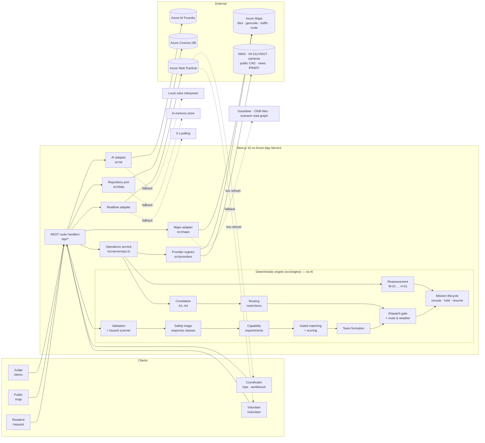
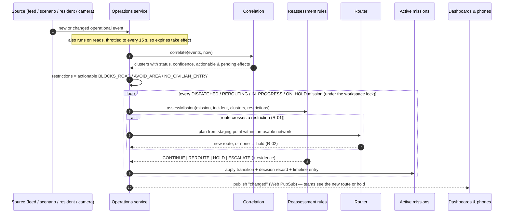
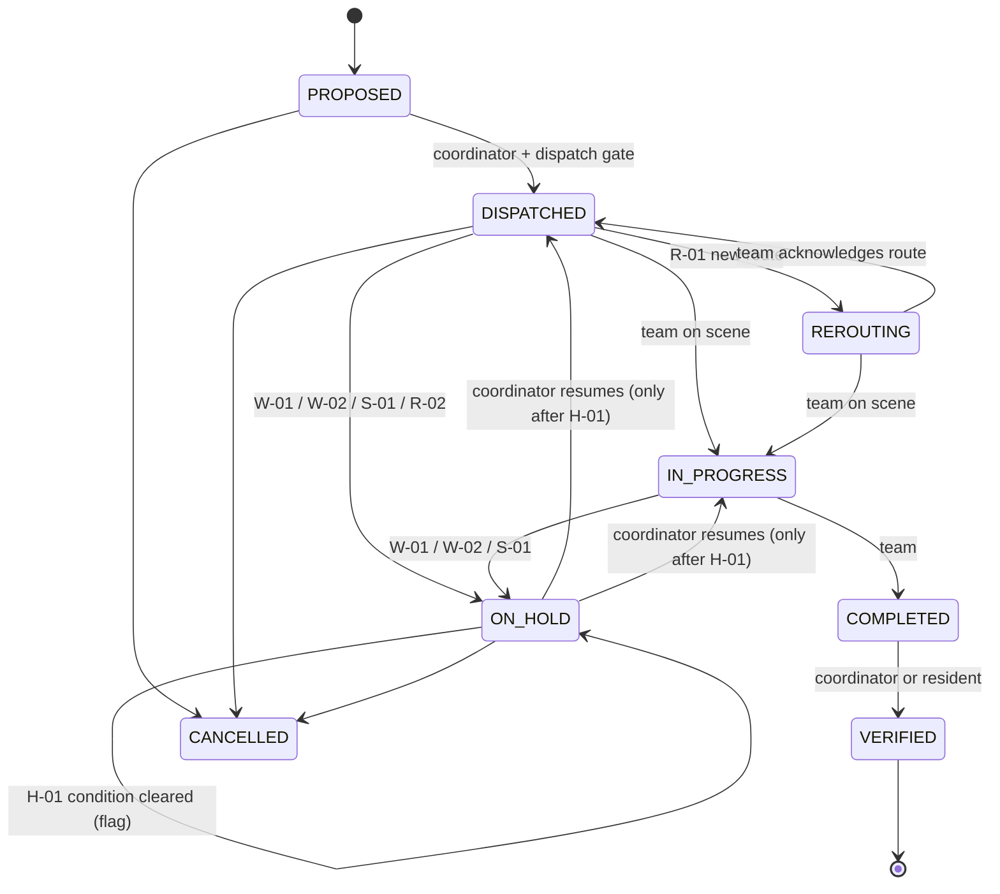
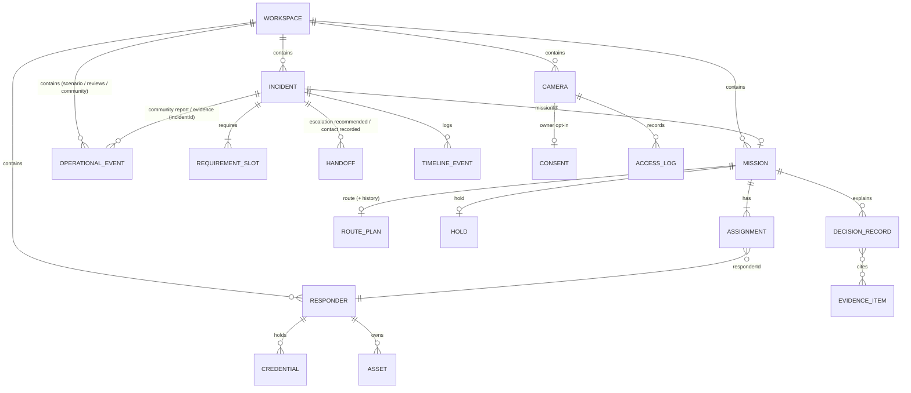

# CoORDINATE architecture

CoORDINATE is a **Navigator → Orchestrator**: it first answers the person, then — only where
appropriate and requested — coordinates a response. Three layers share one deterministic core:

0. **Disaster assistance navigation** — a request (the *incident*: what happened) is
   decomposed into **needs**. Each need gets a **resolution path** — `INFORMATION`,
   `SERVICE_REFERRAL`, `HUMAN_ESCALATION`, `PROFESSIONAL_RESPONSE`, `COMMUNITY_MISSION`,
   `RESOURCE_TRANSFER` or `SITUATIONAL_AWARENESS` — chosen by navigator rules N-01…N-15
   (`src/engine/navigator.ts`), with safety-first guidance, trusted services from the
   assistance directory (`src/data/assistanceDirectory.ts`, with source and date) and, for
   escalations, a handoff that says why, who and what (`src/engine/handoff.ts`).
1. **Community coordination** — only needs on a mission path that the resident *requested* — requests become incidents; rules decide what is safe and
   what capabilities are needed; eligible community resources are matched into teams; a
   coordinator dispatches; completion is verified.
2. **Common operational picture** — weather alerts, traffic, road closures, camera
   observations, public-safety activity and resident road reports are normalized into
   *operational events*, correlated with provenance, turned into road restrictions, and used
   to plan routes and to re-check every active mission whenever the picture changes.

```
Incident ──► Need[] ──► ResolutionPath
                          INFORMATION / SERVICE_REFERRAL ──► AssistanceService (directory)
                          HUMAN_ESCALATION / PROFESSIONAL_RESPONSE ──► Handoff (why · who · what)
                          COMMUNITY_MISSION / RESOURCE_TRANSFER ──► CapabilityRequirement ──► Team ──► Mission
                          SITUATIONAL_AWARENESS ──► OperationalEvent (community report)
```

Need statuses: `IDENTIFIED`, `HELP_AVAILABLE` (offered), `HELP_REQUESTED`, `MISSION_ACTIVE`,
`BLOCKED_BY_HAZARD`, `ESCALATION_RECOMMENDED`, `HANDED_OFF`, `RESOLVED`, `NOT_REQUESTED`. An
incident with guidance only is `GUIDED`; it becomes `OPEN` when help is requested.

An **incident** is what happened; its community needs may become a mission. An **operational event** is a
condition in the environment that constrains missions but never creates one by itself.

## System overview



\* IPAWS, Ring, PulsePoint and agency CAD are partner-only adapters that report
`PARTNER_REQUIRED` until an authorized integration exists.

## Request lifecycle

```mermaid
sequenceDiagram
  autonumber
  participant Res as Resident
  participant API as API
  participant AI as Azure AI Foundry
  participant Eng as Deterministic engine
  participant Ops as Operations service
  participant Coord as Coordinator
  participant Vol as Volunteer team

  Res->>API: POST /api/incidents (free text, location, needs)
  API->>AI: interpret (JSON mode, temperature 0)
  AI-->>API: proposed incident (untrusted)
  API->>Eng: validate + hazard scan + triage + requirements + priority
  alt hazard / immediate danger
    Eng-->>API: ESCALATED + escalation RECOMMENDED (911, utility…)
    API-->>Res: "Volunteers will not be sent — call 911"
    Coord->>API: record contact made (outside CoORDINATE), then acknowledgement
  else information-only road report
    Eng-->>API: LOGGED (no mission)
    API->>Ops: add UNVERIFIED community report → correlate → reassess
  else civilian-eligible
    Eng-->>API: OPEN + required roles
    Coord->>API: propose team
    API->>Eng: gates → score → assemble (reasons attached)
    Coord->>API: dispatch
    API->>Ops: plan route around known restrictions; check site conditions
    API->>Eng: dispatch gate re-validates everything (incl. D-ROUTE, D-CONDITIONS)
    API->>AI: draft briefing (+ deterministic safety lines)
    API-->>Vol: mission + route + briefing (notification simulated)
    Vol->>API: on scene → complete
    Res->>API: verify completion
    API->>Eng: resolve, credit hours, draw down supplies
  end
```

## Continuous reassessment



### Mission states



A held mission never resumes silently: H-01 only records that the condition cleared;
a person decides when the team moves again. A safety hold cannot be overridden from
the dashboard.

## AI versus deterministic responsibilities

| Responsibility | Owner | Where |
| --- | --- | --- |
| Free text (+ photo) → structured proposal | **Azure AI Foundry** | `src/ai/index.ts`, `prompts.ts` |
| Split the situation into needs, with verbatim supporting quotes | **Azure AI Foundry** proposes; quotes not in the text are dropped; scanner findings always kept | `prompts.ts`, `validate.ts#validateNeedEvidence` |
| Resolution path per need, urgency, suggestions | Deterministic (N-01…N-15) | `navigator.ts` |
| Trusted services and eligibility | Deterministic (directory by type, area, declaration status) | `navigator.ts#recommendServices`, `assistanceDirectory.ts` |
| Request coordinated help | **Resident** (or a coordinator on their behalf) | `lifecycle.ts#requestCommunityHelp` |
| Handoff summary (why / who / what) | Template; **Azure AI Foundry** drafts on request, wording policy enforced | `handoff.ts`, `src/ai/index.ts#draftHandoffSummary` |
| Reject unknown codes, clamp numbers, prefer resident answers | Deterministic | `src/engine/validate.ts` |
| Detect hazards | **Union** — AI may add; scanner and resident answers can never be removed | `textScan.ts`, `validate.ts` |
| Response class (emergency · professional · specialized · trained · general · information-only) | Deterministic | `triage.ts`, `rules.ts` |
| Roles, credentials, equipment | Deterministic | `requirements.ts` |
| Eligibility (9 gates), ranking, team | Deterministic | `matching.ts`, `team.ts` |
| Source authority, corroboration, staleness | Deterministic | `correlate.ts` |
| Route within the usable network | Deterministic (Azure Maps for travel time in live mode, re-checked) | `routing.ts`, `src/maps/route.ts` |
| Dispatch | **Human coordinator** after the dispatch gate | `dispatch.ts`, `reassess.ts#dispatchOpsChecks`, `lifecycle.ts` |
| Hold / reroute / escalate in the field | Deterministic policy | `reassess.ts`, `lifecycle.ts#applyAssessment` |
| Resume after a hold | **Human**, only after H-01 | `lifecycle.ts#resumeMission` |
| Camera-frame classification | **Azure AI Foundry** vision → unverified observation | `src/ai/index.ts#analyzeCameraFrame` |
| Briefing, SITREP | **Azure AI Foundry** (language) + deterministic safety lines | `src/ai/templates.ts` |
| Completion verification | **Human** | `lifecycle.ts` |

The model is told it makes no decisions, but the architecture does not rely on that:
nothing the model returns can lower a triage level, make a condition actionable or reach
the dispatch path without passing deterministic code.

## Data model



Types: [`src/domain/types.ts`](../src/domain/types.ts) (coordination) and
[`src/domain/ops.ts`](../src/domain/ops.ts) (operational picture).

- **Incident** — the original request, AI interpretation, scanner hits, validation notes,
  validated assessment, triage (level, rules fired, escalation targets), requirement slots,
  priority, advisories, hazard clearances, **handoffs** (`RECOMMENDED` →
  `CONTACT_RECORDED` → `ACKNOWLEDGED`, `integration: "none"`), offers, audit timeline.
- **Responder** — a person or organization with skills, external credentials, internal
  training badges, assets, availability and travel radius.
- **Mission** — status incl. `REROUTING` and `ON_HOLD`, assignments with reasons, dispatch
  checks, briefing, **route** (`provider`, path, roads, ETA, avoided restrictions, modest
  statement) and **route history**, **hold** (rule, reason, instruction, welfare note, clearance),
  **decision records** (rules applied, result, explanation, evidence, by rules or a person).
- **OperationalEvent** — type, category, source (id, name, type), **authority level**,
  verification status, geometry (GeoJSON), severity, times, expiry, **effects** (`BLOCKS_ROAD`,
  `SLOWS_ROAD`, `HOLD_ALL_ACTIVITY`, `HOLD_OUTDOOR_WORK`, `AVOID_AREA`, `NO_CIVILIAN_ENTRY`,
  `ADVISORY`), optional camera detail, redaction level, latency, coordinator review, linked
  incident. `mode` is `LIVE` or `SCENARIO`; `simulated` is explicit.
- **EventCluster** (computed, never stored) — members with their own provenance, status,
  confidence, actionable effects and *pending* effects with the reason they are not acted on.
- **CameraResource** — public or private; private cameras carry owner **consent** (scope,
  purpose, expiry, revocation) and an **access log**.

Deployments, commitments and restrictions are **derived** (from active missions and
correlated events) rather than stored, so they cannot drift out of sync.

### Cosmos DB layout

| Container | Partition key | Contents |
| --- | --- | --- |
| `incidents` | `/workspaceId` | Incident documents (timeline embedded) |
| `missions` | `/workspaceId` | Missions with route, hold and decision records |
| `responders` | `/workspaceId` | People and organizations |
| `ops` | `/workspaceId` | Operational events and cameras (`docType: "event" \| "camera"`) |

A *workspace* is an operation or a private demo sandbox (`sbx-…`, 7-day TTL). Live-feed
events are cached per process (not per workspace); coordinator reviews of live items are
stored as workspace copies. All queries are single-partition.

### Concurrency

State-changing operations (intake, actions, reassessment, injections, camera access) run
under a per-workspace lock, so check-then-write sequences (dispatch gate → save,
reassess → save) cannot interleave within an App Service instance. A scaled-out deployment
would add Cosmos DB optimistic concurrency (ETags).

## Routes

| Page | Purpose |
| --- | --- |
| `/demo` | 10-step guided judge walkthrough (navigator → orchestrator) |
| `/ops` | Common operational picture: map layers, field operations, conditions, cameras, data sources, SITREP; exercise vs Live Virginia |
| `/ops/incidents/[id]` | Incident workbench incl. route, hold, decision records, evidence |
| `/request`, `/request/[id]` | Resident intake and status (explains holds and reroutes) |
| `/volunteer` | Eligible missions only; active mission with route, hold instructions, route acknowledgement |
| `/map` | Public hazard map (official / corroborated conditions only) |
| `/preparedness`, `/resources`, `/how-it-works` | Training & credentials, capacity, rule tables |

| API | Purpose |
| --- | --- |
| `GET /api/snapshot` | Dashboard state, counts, KPIs, gaps (reassesses if due) |
| `POST /api/incidents` | Intake pipeline (information-only reports also create a community event) |
| `GET /api/incidents/:id` | Incident, mission, matching, dispatch preview incl. route, evidence, opt-in cameras |
| `POST /api/incidents/:id` | `propose` · `ack-advisory` · `record-contact` · `record-ack` · `clear-hazard` · `set-needs` · `offer` |
| `POST /api/missions/:id` | `dispatch` · `start` · `complete` · `verify` · `cancel` · `ack-route` · `resume` |
| `GET /api/ops` | Operational picture for the workspace (clusters, cameras, missions, providers) |
| `GET /api/ops/live` | Read-only Live Virginia view (never affects missions) |
| `POST /api/ops/scenario` | Exercise injections (coordinator, scenario workspaces only) |
| `POST /api/ops/events/:id` | Coordinator `confirm` · `dispute` · `clear` review |
| `POST /api/cameras/:id` | `snapshot` (consent- and purpose-checked, logged) · `revoke` (owner) |
| `GET /api/public/hazards` | Public hazard map data |
| `GET /api/sitrep` | AI-drafted situation report incl. conditions and holds |
| `GET/POST /api/responders/:id`, `GET /api/responders` | Volunteer view and actions; capacity board |
| `GET /api/geocode`, `GET /api/maps/tiles/:z/:x/:y` | Geocoding; Azure Maps tile proxy |
| `GET /api/realtime/negotiate` | Azure Web PubSub client URL |
| `POST /api/persona`, `POST /api/demo/reset`, `GET /api/health` | Simulated sign-in, sandbox reset, health |

## Source layout

```
src/
  domain/      types.ts (coordination), ops.ts (operational picture), labels, DTOs
  engine/      validate, triage, navigator (needs → paths), handoff, requirements, matching, team, dispatch, lifecycle,
               geometry, routing, correlate, reassess (+ __tests__)
  providers/   nws, ipaws, azureTraffic, va511 (+ cameras), publicCad, news, partner,
               registry (cache + derived health), serviceHealth
  ai/          Azure AI Foundry client, prompts, local interpreter, templates
  data/        repository port, Cosmos DB + in-memory adapters, assistance directory, seed scenario,
               scenarioOps (simulated feeds + injections), roadGraph
  maps/        Azure Maps geocoding and routing, offline gazetteer
  realtime/    Azure Web PubSub fan-out
  server/      context, personas, lock, actions, ops (picture · reassessment · cameras), views
  components/  UI: map (shapes, routes, cameras), incident panels, ops panels, badges
  app/         pages and API route handlers
infra/         Bicep template for all Azure resources
```
